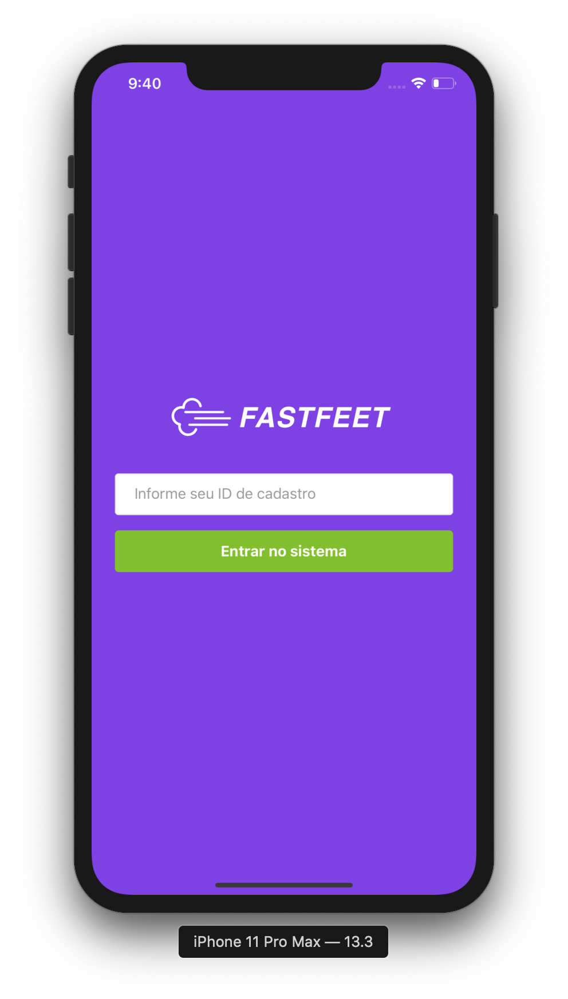
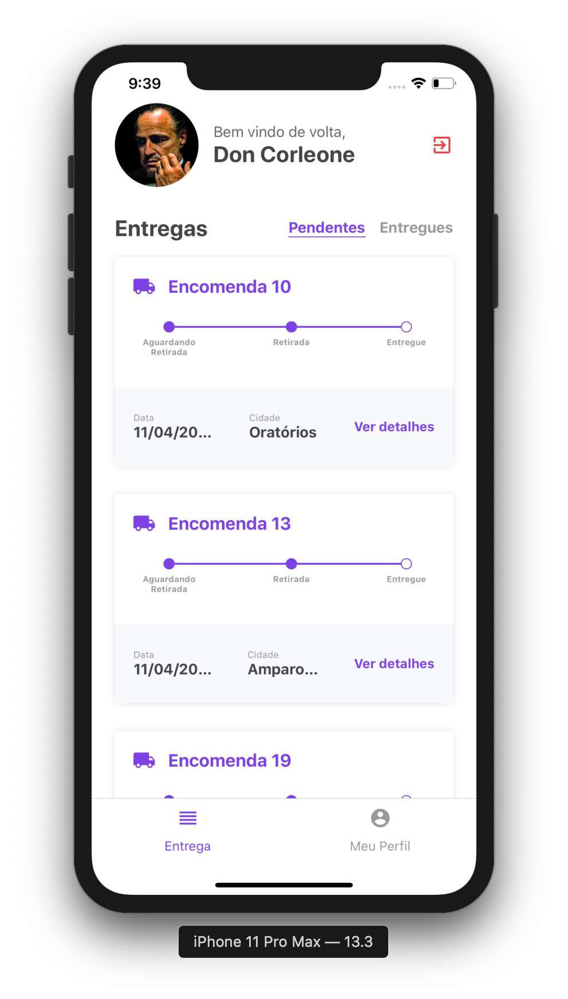
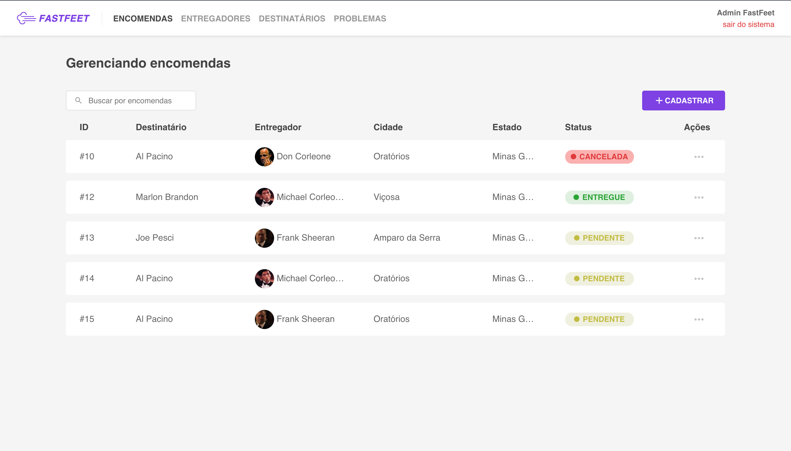

<h1 align="center">
  
</h1>

<p align="center">
  


   <a href="https://www.linkedin.com/in/flaviopangracio/">
    
  </a>

  <a href="https://github.com/flaviohugo14/fastfeet/stargazers">
    
  </a>
</p>

---

<p align="center">
  
  
</p>

<br />

<p align="center">
  
</p>

---
FastFeet é um app para uma transportadora fictícia, o FastFeet.

Esse app faz parte de uma série de desafios propostos pela [Rocketseat](https://rocketseat.com.br) a fim de certificar seus alunos.

## Principais tecnologias

## 🚀 Iniciando a aplicação na sua máquina:
- Clique nos ícones abaixo para configurar Servidor, Web e Mobile separadamente.

<p align="center">
  <a href="server/">
    
  </a>&nbsp;&nbsp;&nbsp;&nbsp;<a href="web/">
  
  </a>&nbsp;&nbsp;&nbsp;&nbsp;<a href="mobile/">
  
</a>

</p>

## 💡Como contribuir:
- Realize um fork do repositório

```
# Instale o GitHub CLI ou a págian do GitHub
$ gh repo fork flaviohugo14/fastfeet

# Clone o seu fork
$ git clone link-do-seu-fork

# Entre na pasta clonada
$ cd fastfeet

# Crie uma branch para sua feature
$ git checkout -b sua-feature

# Commite suas alterações
$ git commit -m "feature: Minha feature"

# Faça o push para a sua branch
$ git push origin sua-feature

```

- Assim que o merge da sua pull request for feito, você pode deletar sua branch.

---
By [Flávio Pangrácio](https://www.linkedin.com/in/flaviopangracio/)
