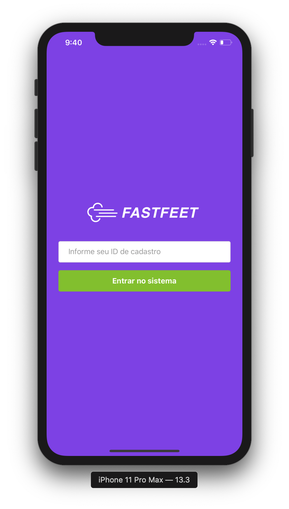
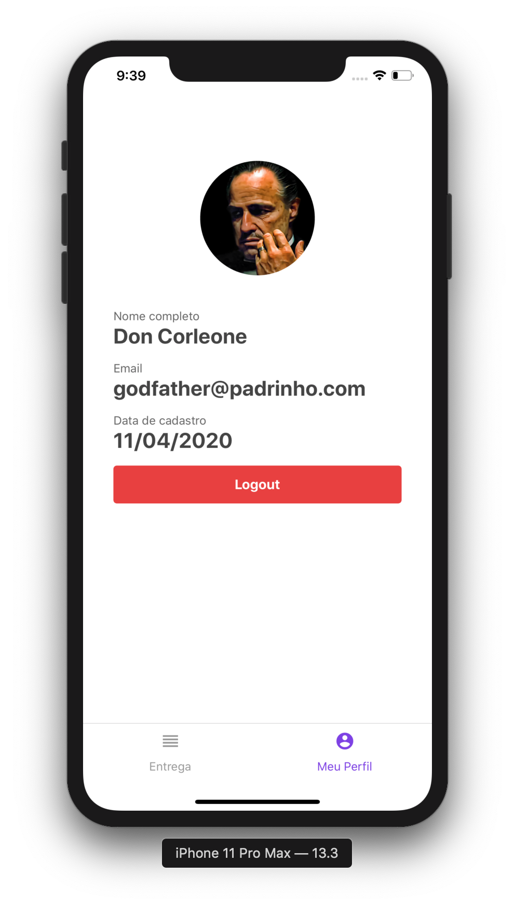
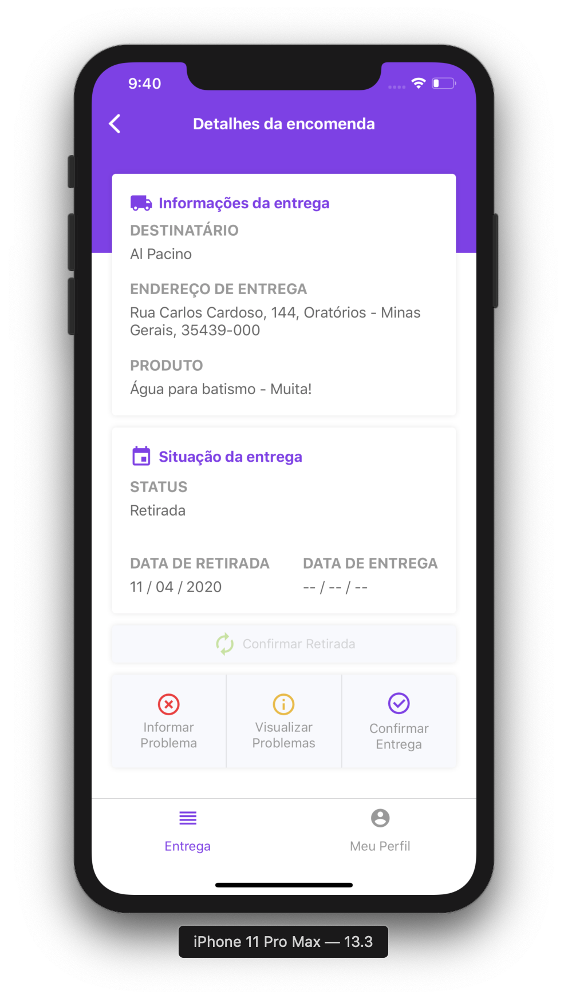
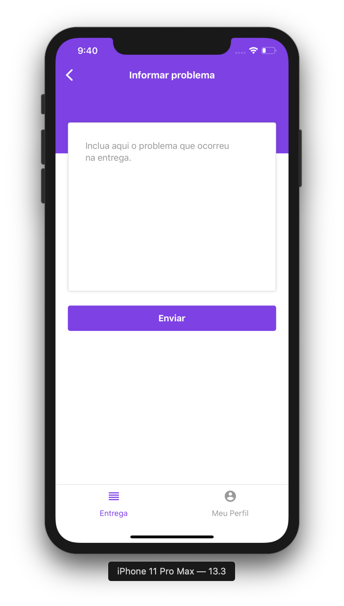
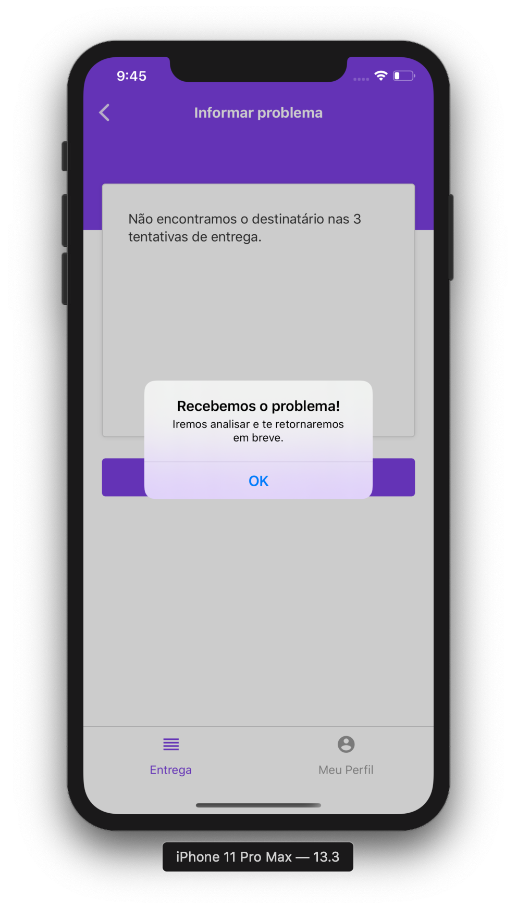
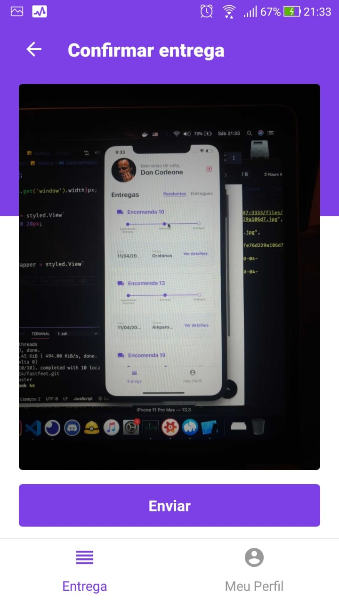

<h1 align="center">
  
</h1>

<p align="center">
  

  

  <a href="https://github.com/flaviohugo14/fastfeet/stargazers">
    
  </a>
</p>

<p align="center">
  <a href="#como-instalar">Como instalar?</a>&nbsp;&nbsp;&nbsp;|&nbsp;&nbsp;&nbsp;
  <a href="#memo-licença">Licença</a>
</p>

---

<p align="center">
  &nbsp;&nbsp;&nbsp;&nbsp;&nbsp;&nbsp;&nbsp;&nbsp;
</a>

---

<p align="center">
  
  
  
</p>

<br />

<p align="center">
  
  
  
</p>

<br />

<p align="center">
  
</p>

---
### Ferramentas utilizadas na aplicação:

- [React Redux](https://github.com/reduxjs/redux)
- [Redux Saga](https://github.com/redux-saga/redux-saga)
- [Axios](https://github.com/axios/axios)
- [Unform](https://github.com/rocketseat/unform)
- [Date-fns](https://date-fns.org/)
- [Immer](https://github.com/immerjs/immer)
- [Styled-components](https://github.com/styled-components/styled-components)

### Ferramentas utilizadas no ambiente de desenvolvimento:
- [ESLint](https://github.com/eslint/eslint) - Lint para identificar erros em tempo de desenvolvimento.
- [Prettier](https://github.com/prettier/prettier) - Padroniza e melhora a visualização do código.

### Ferramentas extras que ajudaram no desenvolvimento:
- [Reactotron](https://github.com/infinitered/reactotron) - App para debugar e controlar estado da aplicação.
- [DevDocs](https://devdocs.egoist.moe/) - App Desktop para consultar documentação.
---

## Como instalar?

Antes de tudo, instale o [Yarn](https://classic.yarnpkg.com/pt-BR/docs/install/).

1. Clone o repositório e entre na pasta ```mobile```:
```
$ git clone https://github.com/flaviohugo14/fastfeet.git
```
```
$ cd fastfeet/mobile
```

2. Instale todas as dependências:
```
$ yarn install

# Se está tentando rodar no iOS, também faça:
$ cd ios && pod install && cd ..
```
3. Abra seu emulador Android ou iOS e instale o app:
```
# Android
$ react-native run-android

# iOS
$ react-native run-ios
```
4. Se o _Metro Bundler_ não se iniciar, rode `$ yarn start`

5. Configure o arquivo `./src/services/api.js` com o endereço de sua API.

 #### OBS: Este aplicativo foi feito utilizando o emulador do iPhone 11 Pro Max e seu design está melhor adaptado com telas de mesma proporção (**19,5:9**) e tamanho.

 #### OBS: A funcionalidade de câmera não pode ser testada.


---
By [Flávio Pangrácio](https://www.linkedin.com/in/flaviopangracio/)

---
## :memo: Licença

Esse projeto está sob a licença MIT. Veja o arquivo [LICENSE](https://github.com/flaviohugo14/fastfeet/blob/master/LICENSE) para mais detalhes.

---
