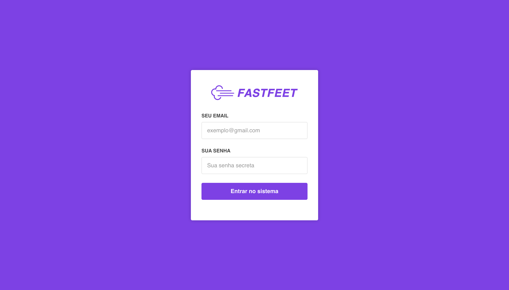
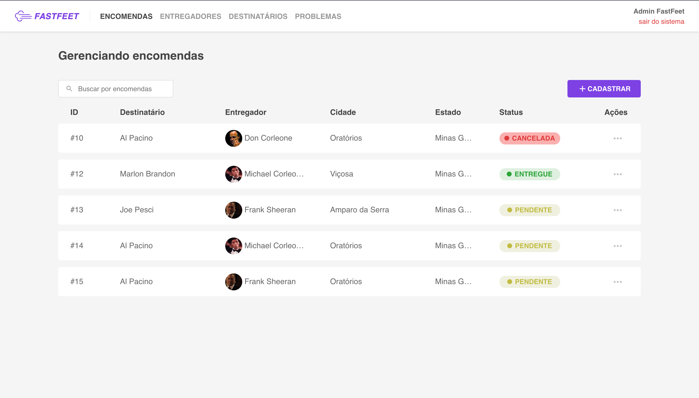
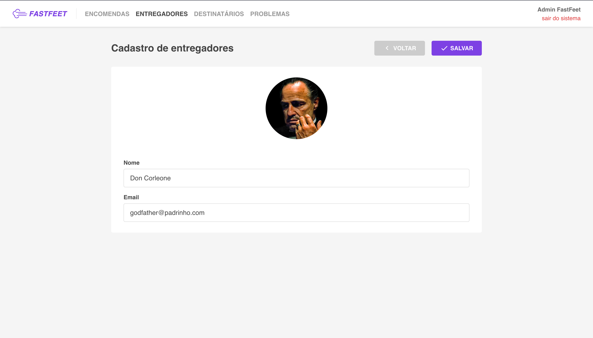

<h1 align="center">
  
</h1>

<p align="center">
  

  

  <a href="https://github.com/flaviohugo14/fastfeet/stargazers">
    
  </a>
</p>

<p align="center">
  <a href="#como-instalar">Como instalar?</a>&nbsp;&nbsp;&nbsp;|&nbsp;&nbsp;&nbsp;
  <a href="#memo-licença">Licença</a>
</p>

---

<p align="center">
  &nbsp;&nbsp;&nbsp;&nbsp;&nbsp;&nbsp;&nbsp;&nbsp;
</a>

---





Página Web do app FastFeet, desenvolvido com [ReactJS](https://github.com/facebook/react).

---
### Ferramentas utilizadas na aplicação:

- [React Redux](https://github.com/reduxjs/redux)
- [Redux Saga](https://github.com/redux-saga/redux-saga)
- Yup
- [React Toastify](https://github.com/fkhadra/react-toastify)
- [Axios](https://github.com/axios/axios)
- [Unform](https://github.com/rocketseat/unform)
- [Date-fns](https://date-fns.org/)
- [Immer](https://github.com/immerjs/immer)
- [Styled-components](https://github.com/styled-components/styled-components)

### Ferramentas utilizadas no ambiente de desenvolvimento:
- [ESLint](https://github.com/eslint/eslint) - Lint para identificar erros em tempo de desenvolvimento.
- [Prettier](https://github.com/prettier/prettier) - Padroniza e melhora a visualização do código.

### Ferramentas extras que ajudaram no desenvolvimento:
- [Reactotron](https://github.com/infinitered/reactotron) - App para debugar e controlar estado da aplicação.
- [DevDocs](https://devdocs.egoist.moe/) - App Desktop para consultar documentação.
---

## Como instalar?

1. Clone o repositório e entre na pasta ```web```:
```
$ git clone https://github.com/flaviohugo14/fastfeet.git
```
```
$ cd fastfeet/web
```

2. Inicie no modo de desenvolvimento:
```
$ yarn start
```

By [Flávio Pangrácio](https://www.linkedin.com/in/flaviopangracio/)

---
## :memo: Licença

Esse projeto está sob a licença MIT. Veja o arquivo [LICENSE](https://github.com/flaviohugo14/fastfeet/blob/master/LICENSE) para mais detalhes.

---
